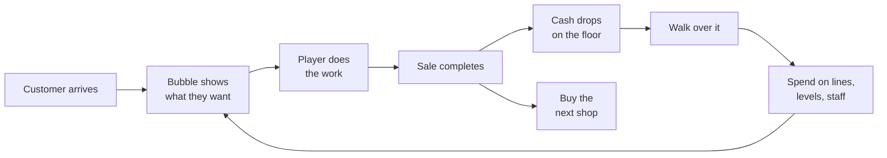
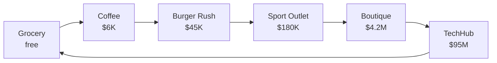
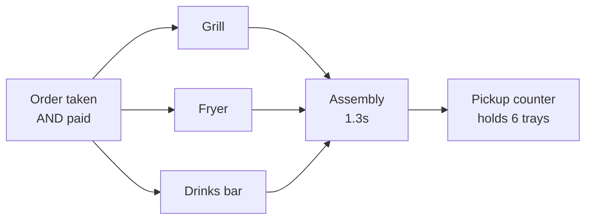
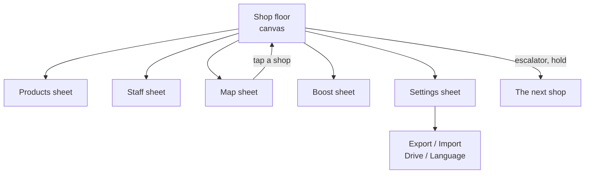
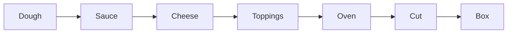

# Mini Shopping Mall — Project Proposal

2026-09-22 · Kaon

## Executive summary

Mini Shopping Mall is a playable arcade-idle store tycoon with six finished shops, each of which is a different game sharing one character, one economy and one save file. It runs today as 14,191 lines of plain JavaScript in 24 files, with no bundler and no build step.

The pitch: *you are the whole staff of a mall, one unit at a time.* You drive a character round a single shop floor, read what each customer wants from the bubble over their head, do the work they are waiting on, and take the money off the floor. Earn enough and the escalator in the corner unlocks the next shop, which asks a different question.

The design bet is that one control scheme can carry six unrelated genres. Each shop keeps the joystick and the thought bubble and changes what the bubble means:

| Shop | Unlock | The question it asks | Genre |
| --- | --- | --- | --- |
| Grocery Store | free | Is the shelf full? | stocking |
| Coffee Shop | $6K | Is it made yet? | service |
| Burger Rush | $45K | Which station is holding up the tray? | bottleneck |
| Sport Outlet | $180K | Have they tried it, and did anyone advise them? | selling |
| Fashion Boutique | $4.2M | Have you got it in their size, and is a cubicle free? | matching |
| TechHub | $95M | Which of the two is right for them? | comparison |

What this proposal commits to: the full specification of those six shops as built, the rules that govern them, and a screen-by-screen interface guide — so the game can be handed to an artist, a balancer or a second engineer without reading the source. It also states what is deliberately absent (sound, prestige, a day cycle, collision for anyone but the player) and what the seventh shop needs from the save format before it can be added.

## Vision and design pillars

The genre is **arcade-idle, not idle-clicker**. The player's body is in the game: you walk, you carry, you stand at the till. Staff exist to automate the parts you have grown bored of, which means the manual loop has to be worth doing first. An earlier tap-a-shop-to-collect build was discarded for exactly this reason — same art, wrong product.

Five pillars govern every feature.

1. **The player's body does the work.** Before designing anything, ask where the character stands and what they carry. A mechanic that resolves in a menu is not a mechanic.
2. **Every shop is its own game.** The brief was explicit: do not make seven shops where a customer walks in, clicks and pays. Each shop must change the question, not the skin.
3. **Nothing is delivered — it is made, fetched or fitted on site.** The chain from raw thing to sale is always walkable, and always visible on the floor.
4. **Automation is a body, not a boolean.** A hire must appear on the floor and be seen doing the job. A hire that is only a flag in a menu reads as a missing character.
5. **Every screen says what to do next.** A locked row with no cost and no position in the order reads as a bug. So does a shop with no guidance line.

### What the game is judged on

Playtesting is done by driving the character, on feel rather than on numbers. Four complaints recur and function as acceptance criteria for any new floor:

| Criterion | The rule it produces |
| --- | --- |
| Walking room | A lane you walk through is at least 1.0 wide; bodies are 0.22 across |
| No accidental triggers | A lane you only pass along sits clear of `REACH` (0.8) from any usable station, or walking past the cow milks it |
| Short feed hauls | Every consumer stands beside its input. Wheat once sat 19 units from the trough that ate it |
| Visible guidance | One line under the HUD, always, saying the next thing worth doing |

### Audience and platform

The target is a mobile-first casual player who knows *My Mini Mart*, *Idle Mall Tycoon* or *Burger Please*. Those three are the stated references.

It ships as a single HTML page: touch-first, joystick-driven, portrait-friendly, and playable from a double-clicked `index.html` with no server. That constraint is deliberate — it keeps the game distributable as a folder, a static host or a wrapped mobile shell without changing a line. Four languages are shipped: English, Simplified Chinese, Traditional Chinese and Bahasa Melayu.

### What it is not

Not a clicker. Not a city builder — the player never places a fixture; every floor plan is authored. Not multiplayer, and not online: there is no server, no account and no leaderboard.

## Game specification

The player occupies exactly one shop at a time. Every shop is a closed, authored floor with a street door, a counter, a back-of-house area and an escalator. The other shops keep running while you are away, but only if they are staffed.

### The core loop



Step C is the only step that differs between shops. Everything around it is shared.

### World and projection

The scene is a 2:1 dimetric isometric grid drawn to a single canvas. One cell is 64 px wide by 35 px tall; one unit of height is 42 px. Tile size is fitted to the smaller screen axis, so a wide desktop window does not zoom past the floor.

The camera trails the player rather than being dragged, easing toward a point 0.6 units above their feet. It is clamped so all four screen corners stay on the floor at any zoom between 0.7x and 1.7x.

Each shop declares its own floor box. The Grocery Store is the largest at 27.5 x 19.0 units, because it is the only one with a farm bolted onto the back; the default box is 23.5 x 15.2.

### Movement and physical constants

| Constant | Value | Meaning |
| --- | --- | --- |
| `PLAYER_SPEED` | 3.8 units/s | top speed at full stick |
| `STAFF_SPEED` | 2.9 units/s | hired staff |
| `CUSTOMER_SPEED` | 2.1 units/s | shoppers |
| `ACCEL` | 14 | how sharply a new heading is taken up |
| `BODY_R` | 0.22 units | body radius, for separation and walls |
| `REACH` | 0.8 units | how close you stand to use a station |
| `CARRY_CAP` | 12 items | arms hold any mix, stacked overhead |
| `CARRY_SLOW` | 0.4 | fraction of speed lost with full arms |
| `HANDLE_RATE` | 9 items/s | in and out of your arms |

Only the player collides with fixtures. Customers and staff collide with each other but pass through scenery, which is a known limitation.

### Tick model

The game runs one `requestAnimationFrame` loop. Frame delta is clamped to 0.1 s; a delta over 1.5 s (a backgrounded tab) is handed to a catch-up pass and the frame proceeds at 0.05 s. Order within a frame is fixed:

1. Rebuild the walkability cache, then run station restock timers.
2. Move the player, the stockers and the cashier.
3. Spawn and step customers; age cash piles.
4. Run the active shop module (cafe, food, sports, boutique or tech); the generic till runs only for shops that do not own their counter.
5. Separate bodies so no two end the frame in the same spot.
6. Run the floor pads in order: till plot, build plots, OPEN sign, guidance, level pads, doors, passive income from other shops, mall level check.
7. Ease the camera, render, refresh the HUD.

Progress autosaves every 10 seconds of loop time, and on `visibilitychange` and `pagehide`.

### Shopper arrival and the escalator

Customers arrive only while the OPEN sign is flipped. The gap between arrivals interpolates from 3.0 s when quiet to 1.3 s when busy, driven by mall level over 12, and the floor is capped at 9 shoppers at once.

Once a second shop is open, 45% of arrivals and departures use the escalator instead of the street door, because those shoppers are doing the whole mall rather than one unit. A ride takes 2.6 s end to end; the run climbs 1.05 units and the rider's height tracks the tread exactly. With one shop open the escalator is idle.

### The shopping list

Outside the tutorial, a Grocery shopper carries a list rather than a single want.

| Roll | Odds |
| --- | --- |
| 1 / 2 / 3 different products | 45% / 33% / 22% |
| 1 / 2 / 3 of each product | 55% / 28% / 17% |
| Total items carried | capped at 6 |

They collect shelf by shelf, taking 0.28 s to lift each item, then pay one total at the till. A shopper who hovers behind a full queue for 25 seconds gives up and puts the whole basket back.

### Systems every shop shares

- **Build plots.** A product line, a machine, a court, a cubicle or the till itself starts as a plot on the floor. Stand on it and your cash drains in until it is paid; partial payment is remembered.
- **Level pads.** Every station has a pad beside it. Standing on it pours cash into the next level, raising that line's price and its production speed.
- **The OPEN sign.** By the door. Flipping it is what lets customers in.
- **Cash on the floor.** Each sale drops a pile. Walk over it to bank it; a pile left 9 seconds banks itself, so idling still pays.
- **The bin.** Walk into it to empty your arms when you picked up the wrong thing.
- **The queue.** A counter with a queue slot line running back toward the door.
- **Passive income.** Every shop you are *not* standing in accrues its rate continuously, provided it is staffed.

## Shop roster and progression

Six of the seven planned shops are built. The seventh, a Pizza Restaurant, is specified but not implemented; it is the only gap in the roadmap.

| # | Shop | Signature loop | Unlock | Status |
| --- | --- | --- | --- | --- |
| 1 | Grocery Store | Stock → Pick → Checkout | free | built |
| 2 | Coffee Shop | Order → Prepare → Serve → Table | $6K | built |
| 3 | Burger Rush | Order → Kitchen → Assemble → Pickup | $45K | built |
| 4 | Pizza Restaurant | Dough → Toppings → Bake → Box | to be set | **not built** |
| 5 | Sport Outlet | Browse → Try → Advice → Buy | $180K | built |
| 6 | Fashion Boutique | Browse → Size → Fitting room → Buy | $4.2M | built |
| 7 | TechHub | Browse → Demo → Compare → Buy | $95M | built |

The unlock ladder is steep on purpose: each shop is roughly 4x to 20x the last, and the two late shops are separated by more than an order of magnitude, because TechHub's products are worth millions each.

### The mall is a ring

Shops are not a menu. Each floor has an escalator in one corner that rides to the next shop, and the last one wraps back to the first. The Map draws that ring directly.



A link is drawn solid where you can ride it and dashed where the far end is still locked. Tapping a box travels there, or buys it open if you can afford it. The middle of the ring carries the one figure that belongs to the mall rather than to any shop: what the place earns while you are away.

You can also travel physically. Stand in front of the escalator and hold for 0.45 units of approach and a moment of dwell, and it carries you up.

### Why each shop is a different game

The brief was explicit — do not build seven shops where a customer walks in, clicks and pays. Each shop introduces exactly one new scarce resource, and that resource is what the player manages.

| Shop | The scarce thing | The failure it produces |
| --- | --- | --- |
| Grocery | shelf stock, and the feed that makes it | an empty shelf; the shopper walks |
| Coffee | machine time, ingredients in the bar, clean tables | a cold queue and no tips |
| Burger Rush | the slowest station's throughput | tickets paid for and refunded |
| Sport Outlet | your attention — someone must advise | a shopper who tried it and left it |
| Boutique | a size on the rail, and a free cubicle | a full rail that is still empty to them |
| TechHub | sealed boxes, and a translated spec sheet | a convinced buyer at an empty stand |

### Product lines within a shop

Every shop opens its lines one at a time, in a fixed order, at their own build plot on the floor. Rank sets the price band, so later lines are always worth more. The Grocery Store has 18 lines (17 sellable plus wheat, which is feed); the other five have 8 to 16 each.

The cheapest line in each shop is free and arrives with the store. The dearest is a long-term goal: oranges at $85K in Grocery, a TechVision TV at $260M in TechHub.

## Per-shop specification

Each shop below is given as: its floor, its lines, its stations, its staff, and the one rule that defines it.

### 1. Grocery Store — the stocking game

Floor 27.5 x 19.0, the largest in the mall, because nothing is delivered. Nine crop beds run across the back wall, an orchard of three trees down the right, and the farmyard is a column down the left, ordered so nothing is far from what it eats: pig, chicken, wheat field, cow, oven, yogurt vat. The shop floor in the middle holds the shelves in three rows, tinted and labelled by department.

The production chain is the shop:

| Product | Comes from | Needs |
| --- | --- | --- |
| Potato, Tomato, Carrot, Eggplant, Cabbage, Cucumber, Watermelon, Strawberry, Blueberry | crop beds | time only |
| Apple, Banana, Orange | the orchard | time only |
| Wheat (not sold) | the wheat field | time only |
| Milk | the cow | wheat in the trough |
| Bread | the oven | wheat |
| Yogurt | the vat | milk |
| Bacon | the pig pen | potatoes |
| Eggs | the chicken coop | tomatoes |

The wheat field sits between the cow and the oven — the only two things that want it — and the vat sits under the cow it draws milk from. That placement is a rule, not a decoration: an earlier layout put wheat 19 units from the trough and it played badly.

Prices run from $9 (potato) to $355 (orange). Lines unlock from free (potato) to $85,000 (orange) in 18 steps.

**The defining rule:** a shelf holds 8. A shopper standing at an empty shelf is the only thing that drains patience.

### 2. Coffee Shop — the service game

Nothing waits on a shelf. Six ingredients live in crates along the back wall and must be carried to the **ingredient storage** beside the bar; the machines draw only on that storage, never on the crates. An empty bin is why nothing is brewing.

Ten recipes live on a menu board, each its own build plaque. Three machines make them:

| Machine | Build cost | Worked by | Makes |
| --- | --- | --- | --- |
| Coffee Machine | free | Barista | Espresso, Americano, Latte, Cappuccino, Iced Coffee, Mocha |
| Matcha & Ice Bar | $4,000 | Barista | Matcha Latte, Iced Matcha |
| Pastry Oven | $12,000 | Chef | Croissant, Cake |

Prices run $90 (espresso) to $560 (cake). Once the oven is built, 45% of tickets add a food item and a further 15% add a second; the ticket splits one job per item, each routed to its own station, and the customer pays the whole bill when the last item reaches their hands.

Seating is six tables, two free and four build plots at $900, $2,400, $6,000 and $14,000. A served customer sits for 8 to 15 seconds and leaves the table dirty. A dirty table cannot be sat at and drags tips down; wiping one takes 1.1 s. If every table is dirty or taken, they take the drink away instead.

Four jobs beyond runner and cashier: Barista, Chef, Server, Cleaner. A machine runs only when its own person is hired, or you stand at it. The barista never bakes and the chef never brews.

**The defining rule:** tips, capped at 25% of the price, are where the money is — and they are paid for speed in a clean room.

### 3. Burger Rush — the bottleneck game

Eight lines across three stations, and every combo touches all three. The ticket splits three ways, the parts cook in parallel, and the tray is not assembled until the slowest part is done.



| Station | Build cost | Lines |
| --- | --- | --- |
| Grill | free | Cheeseburger $190, Double Burger $320, Chicken Burger $480 |
| Fryer | $5,000 | Fries $120, Nuggets $210, Fried Chicken $640 |
| Drinks Bar | $14,000 | Cola $100, Milkshake $260 |

62% of customers want the meal rather than just the main. Each station shows its own load on the floor and the worst is flagged red. Levelling a station does not end the problem, it moves it: a measured run took the fryer from load 3.7 to 0.4 and the grill from 1.2 to 3.0, and trays out went from 39 to 44 over the same 80 seconds.

This is the only shop that takes money **up front**, which means a walkout must be **refunded**. Without the refund a jammed kitchen would be free money and the bottleneck would stop mattering. With nobody hired the line seizes: a measured run gave 15 orders taken, 0 trays out, 9 walkouts.

Each line has a **line bin** of raw stock in front of its station. A station with an empty bin cannot start however fast it is. Two hires: a **Line Cook** works the stations, a **Packer** builds the trays.

### 4. Sport Outlet — the selling game

The goods are already made and already on the rack. Four sports, two lines each, and a court for every one of them.

| Sport | Lines | Court | Court cost |
| --- | --- | --- | --- |
| Running | Running Shoes $2.4K, Water Bottle $3.2K | treadmill | free |
| Football | Football $4.8K, Football Boots $6.4K | goal | $60,000 |
| Basketball | Basketball $9K, Team Jersey $12K | hoop | $200,000 |
| Badminton | Racket $17K, Shuttlecocks $24K | net | $500,000 |

A sport without a built court still sells, to about half as many people. A shopper picks a product up, carries it to its court, tries it for 3 to 5 seconds, then decides: buy, too dear, or not for me. A rejection goes back on the rack, and half the time becomes "show me another one".

**Advice is the other half of the sale.** A shopper holding something and wondering shows a question mark. Stand within 1.6 units for 0.9 s and they are talked into it. Good advice also raises what they will pay by 25%, which rescues shoppers who simply cannot afford what they picked up. A hired **Sports Advisor** does this without you, and the shop earns nothing unattended until you have one.

**The defining rule:** nobody buys what they have not tried.

### 5. Fashion Boutique — the matching game

Eight lines in four departments. Six are garments, which carry four sizes and must be tried on; the cap and the handbag have no size and skip the cubicle, which makes them the quick sale when the shop is heaving.

Every rail shows its size breakdown on the floor — `S 2 · M 0 · L 1 · XL 3` — with a red pip for a size that has run out. Shoppers arrive wanting S, M, L or XL at 20 / 34 / 30 / 16 percent, so the middle sizes empty first. That is the whole reason the stockroom ever gets a visit.

A shopper at a rail with none of their size raises a ruler and waits on a **shorter fuse than anything else in the game** — 45 s against the shop's normal 70. Walk to the stockroom, pick one up, carry it over, and it goes into their hands; being served like that is worth a sale on its own. A hired **Fashion Assistant** runs those errands.

Five cubicles: two free, then $120K, $400K and $900K. They are the bottleneck.

| Fitting rooms | Conversion |
| --- | --- |
| 2 | 41% |
| 5 | 66% |

Prices run $38K (cap) to $380K (handbag). 42% of shoppers are after two pieces rather than one.

### 6. TechHub — the comparison game

Nobody comes in for a named product. They come in for a *kind* of thing, with a priority and a budget, and every department stocks a pair that pulls in opposite directions.

| Department | The pair | The argument | Demo bench |
| --- | --- | --- | --- |
| Audio | TechBuds $900K vs TechSound Max $1.9M | battery vs room-filling sound | free |
| Phones | TechPhone $1.4M vs TechPhone Pro $2.6M | all-week battery vs the camera | $30M |
| Laptops | TechBook Air $3.4M vs TechBook Pro $6M | thin and long-lived vs fast and hungry | $90M |
| Screens | TechView 144 $4.5M vs TechVision TV $8M | refresh rate vs sheer size | $220M |

Products carry rated specs — performance, battery, camera, display, sound — on a 1-to-5 scale, and the customer's own priority decides which of the pair is "better". They look at the first, demo it, look at the second, demo that, weigh the two, and buy the winner they can afford.

**Demoing is free; selling needs a box.** Fifty people can try the floor unit, but a sale takes a sealed box on the stand — that is what the stockers haul. A shopper who has already decided will wait at an empty stand exactly as long as their patience lasts.

| Shop floor | Conversion |
| --- | --- |
| Cold — no benches, nobody advising | 28% |
| All four benches | 62% |
| Benches plus a Tech Advisor | 70% |

**The defining rule:** a spec sheet is noise until somebody translates it.

## Staff, stock and logistics

Staff are bought once, not paid wages. Every hire appears on the floor as a body doing the job, which is a hard requirement: a hire that is only a flag in a menu reads as a missing character rather than an upgrade.

### The roster

| Role | Shops | Cost formula | Floor |
| --- | --- | --- | --- |
| Stocker (runner) | all | `max(1800, unlock x 0.7) x 3.2^owned` | $1,800 |
| Cashier | all | `max(2500, unlock x 0.9)` | $2,500 |
| Barista | Coffee | `max(3200, unlock x 1.1)` | $3,200 |
| Chef | Coffee | `max(4000, unlock x 1.35)` | $4,000 |
| Server | Coffee | `max(4800, unlock x 1.6)` | $4,800 |
| Cleaner | Coffee | `max(2200, unlock x 0.75)` | $2,200 |
| Line Cook | Burger Rush | `max(2600, unlock x 0.9)` | $2,600 |
| Packer | Burger Rush | `max(3400, unlock x 1.2)` | $3,400 |
| Sports Advisor | Sport Outlet | `max(9000, unlock x 1.4)` | $9,000 |
| Fashion Assistant | Boutique | `max(12000, unlock x 1.3)` | $12,000 |
| Tech Advisor | TechHub | `max(30000, unlock x 1.2)` | $30,000 |

`unlock` is the shop's own purchase price, so staff scale with the shop they work in. Stockers are capped at four per shop and each costs 3.2x the last, which makes the fourth roughly 33x the first.

### What a stocker actually does

A stocker runs a two-priority job queue. Feed comes first: it hauls input to whatever station is starving — wheat to the cow, potatoes to the pig, tomatoes to the chicken, milk to the vat. Only then does it restock the emptiest shelf.

Stockers **claim** jobs, so two never chase the same shelf. One alone cannot keep eleven shelves and four feed stations running, which is the reason the cap is four rather than one.

### Capacities

| Store | Holds |
| --- | --- |
| Your arms | 12 items, any mix |
| A shelf | 8 |
| A station's output crate | 10 finished items, then it stalls |
| An animal or machine's feed hopper | 8 input items |
| Cafe pickup counter | 8 finished drinks |
| Burger Rush pickup counter | 6 trays |

A station whose output crate is full stops producing. That is the signal to go and empty it.

### Earning while you are away

A shop accrues income continuously while you stand in a different one, and offline for up to 2 hours at 50% rate. It earns **nothing** unless every gate below is satisfied:

| Gate | Applies to |
| --- | --- |
| Owned, till built, sign OPEN | every shop |
| At least one stocker, and a cashier | every shop |
| Barista **and** Server hired | Coffee Shop |
| Chef hired — otherwise the food lines alone earn nothing | Coffee Shop |
| Line Cook **and** Packer hired | Burger Rush |
| Sports Advisor hired | Sport Outlet |
| Fashion Assistant hired | Boutique |
| Tech Advisor hired | TechHub |

The unattended conversion rate is the shop's own buy formula with the advice bonus applied and the demo or fitting bonus applied where the facility is built, then multiplied by 0.85 — because some shoppers still cannot afford it. Unattended earning is therefore always slightly worse than a good human.

### Restock and production timing

Each line declares a `restock` period in seconds, from 1.2 s (ice) to 3.4 s (orange, bread). A station produces one item per period, scaled by the speed multiplier its level has earned. `MIN_RESTOCK` floors the period at 0.35 s, so no amount of levelling makes a station instant.

Machine and station levels buy two things at once. In the cafe, each level adds 0.34 to brew speed and every third level adds a concurrent cup, capped at 4. In Burger Rush, each level adds 0.30 to cook speed and every second level adds a concurrent part, capped at 5 — the faster ramp is what lets the player chase a moving bottleneck.

## Economy and balance

Everything tunable lives in one file, `src/config.js`. No other file hard-codes a number, and that is enforced by convention rather than by tooling.

### Price and upgrade curves

A line's sale price is linear in its level, stepped by milestone multipliers and by any active boost:

```latex
\text{price} = \text{base} \times \text{level} \times M_{\text{income}}(\text{level}) \times B
```

The cost of the next level grows geometrically at 1.13 per level from a base of `max(60, base price x 7)`:

```latex
\text{cost}(k) = \text{base}_{\text{up}} \times 1.13^{\,\text{level}-1}
```

Levels are capped at 100. Milestones multiply price and production speed on the way up:

| Level | Income multiplier | Speed multiplier |
| --- | --- | --- |
| 10 | x2 | — |
| 25 | x2 | x2 |
| 50 | x2 | x2 |
| 100 | x3 | x2 |

A fifth milestone at level 200 sits above the cap and can no longer be reached. It is kept in the table so that a save made before the cap existed keeps the multipliers it already bought — capping levels must not quietly nerf someone's shop.

A fully levelled line therefore earns 24x its base price per item, and produces at 8x its base speed, floored at one item per 0.35 s.

### Mall level, gems and the boost

Mall level rises with the sum of every product level you own across every shop. The threshold for level *n* is `5n(n+1)`, so level 2 needs 30 total levels, level 5 needs 150, level 10 needs 550.

Each mall level pays 3 gems. Fifteen gems buy a Rush Hour: x2 income for 60 seconds. Mall level also drives demand — arrival spacing interpolates from 3.0 s to 1.3 s as mall level climbs toward 12.

### Starting position and the first purchases

| Item | Cost |
| --- | --- |
| Starting cash | $500 |
| Checkout counter | `max(100, unlock x 0.02)`, so $100 in Grocery |
| First product line | free |
| Second line (tomato) | $250 |
| First stocker | $1,800 |
| First cashier | $2,500 |
| Coffee Shop | $6,000 |

### Patience, by shop

Patience is the ring around a customer's bubble. What starts it draining differs by shop, and that difference is the balance lever.

| Shop | Patience | Grace | Drains while |
| --- | --- | --- | --- |
| Grocery | 25 s queue patience | — | standing at an empty shelf, or behind a full queue |
| Coffee | 46 s | 7 s | queueing, and from the moment the order is taken |
| Burger Rush | 55 s | 5 s | holding a paid ticket |
| Sport Outlet | 60 s | 6 s | waiting at an empty rack |
| Boutique | 70 s, but 45 s on a size request | 6 s | queueing for a cubicle, or waiting on a size |
| TechHub | 60 s | 6 s | waiting on a sold-out box |

The boutique's 45-second size fuse is deliberately the shortest timer in the game, because fetching a size is the stage's signature job and it has to feel urgent.

### The buy roll

Three shops resolve a sale as a probability rather than a transaction. All three cap at 96%.

| Term | Sport Outlet | Boutique | TechHub |
| --- | --- | --- | --- |
| Base | 34% | 46% | 30% |
| Tried it / fitted it / demoed it | +30% | +26% | +18% |
| Compared against the rival | — | — | +16% |
| Advised by a person | +26% | +22% | +24% |
| Per product level | +0.8% | +0.8% | +0.8% |
| Budget, as a multiple of price | 0.72x to 2.20x | 0.80x to 2.40x | 0.70x to 2.20x |
| Budget after good advice | x1.25 | — | x1.30 |

A rejected item goes back on the rack. In the Sport Outlet, half of all rejections become "show me another one" rather than a walkout.

### Failure states

| Failure | Where | Cost to the player |
| --- | --- | --- |
| Walkout at an empty shelf | Grocery | the sale |
| Abandoned queue after 25 s | Grocery | the whole basket goes back |
| Ticket expires | Coffee | the sale and the tip |
| Every table dirty or taken | Coffee | they take it away; tips drop |
| Ticket expires | Burger Rush | the sale **and a refund**, because they paid up front |
| Empty line bin | Burger Rush | the station cannot start at any level |
| Left unadvised | Sport Outlet, TechHub | conversion collapses toward the base rate |
| Size missing, nobody fetches | Boutique | a 45-second fuse, then a walkout |
| No free cubicle | Boutique | conversion falls from 66% to 41% |
| Sold out of sealed boxes | TechHub | a convinced buyer waits, then leaves |

### The known balance lesson

Advice must not replace the rest of the loop. In TechHub, an early build let advised shoppers buy without demoing, and the demo benches stopped mattering. The rule that came out of it: **an advised shopper must still go to the bench.** Advice changes what they buy and what they will pay; it never skips a step of the loop.

## Rules of play

This section is the rulebook: what the player may do, in what order, and what happens at the edges.

### Opening a shop

Every shop, without exception, opens the same way. A gold arrow on the floor walks the player through it once, and only once, per shop.

1. **Build the counter.** Stand on the checkout plot until your cash has drained in. Cost is 2% of the shop's unlock price, minimum $100. Nothing can be sold before this.
2. **Get the first line's goods in place.** In Grocery that means harvesting potatoes and putting them on the shelf; in the cafe it means carrying beans to the bar storage; in each shop it is that shop's equivalent.
3. **Flip the OPEN sign** by the door. No customer enters before this.
4. **Serve the first customer** at whatever this shop counts as a counter.
5. **Run over the cash.** First sale. The script ends here and never runs again for that shop.

After the script ends, the same line under the HUD becomes a live to-do, recomputed every frame: the cow whose trough has run dry, a queue with nobody on the till, the next line you can afford to build, the next shop you can afford to buy.

### Legal actions

The player has no verbs beyond moving and standing. Everything is proximity-triggered.

| Action | How |
| --- | --- |
| Move | Drag anywhere for the floating joystick, or WASD / arrows |
| Pick up | Walk within 0.8 units of a station with output ready |
| Put down | Walk to the shelf, hopper or storage that takes it |
| Empty your arms | Walk into the bin |
| Serve | Stand behind the till while someone is at the front of the queue |
| Advise | Stand within 1.6 units of a shopper showing a question mark, for 0.9 s |
| Hand over a size | Carry it from the stockroom to within 1.4 units of the asker |
| Build | Stand on the plot; cash drains in continuously |
| Level up | Stand on the station's level pad; cash drains in continuously |
| Open or close | Stand on the OPEN sign |
| Travel | Stand in front of the escalator and hold, or tap a box on the Map |
| Zoom | Scroll wheel, 0.7x to 1.7x |

There is no inventory screen, no drag-and-drop, and no placement mode. If it is not reachable by walking, it is not in the game.

### Carrying

Arms hold 12 items of any mix, stacked over the character's head. A full armful costs 40% of top speed, which is the only movement penalty in the game. Items go in and out at 9 per second, so a full load takes about 1.3 s to transfer.

Carrying the wrong thing is recoverable: the bin empties your arms with no penalty beyond the walk.

### Serving at the till

The front of the queue is served when the player stands at the counter, or automatically when a cashier is hired. Serve time is `max(0.6 s, items x 0.35 s + 0.25 s)` — bigger baskets take longer, because each item gets its beat in the bag.

Standing at the till **while** a cashier is also hired runs the queue 1.7x faster. That is the only place in the game where the player and a hire stack.

### Scoring

There is no score and no end. Four running figures stand in for one:

| Figure | Where it shows | What it means |
| --- | --- | --- |
| Cash | HUD, top right | spendable now |
| Gems | HUD, top right | 3 per mall level; 15 buys a Rush Hour |
| Mall level | HUD, centre | sum of every product level you own, thresholded at `5n(n+1)` |
| Conversion | Staff sheet, retail shops | of everyone who walked in, how many walked out with a bag |

Conversion is the honest scoreboard in the Sport Outlet, the Boutique and TechHub, because in those shops a customer served badly still leaves without buying.

### Edge cases

- **A full output crate stalls its station.** Ten finished items and production stops until you clear it.
- **A full queue turns people away.** Anyone hovering behind it for 25 seconds puts their whole basket back on the shelves.
- **Wheat is not sellable.** It exists only as feed for the cow and the oven, and has no price and no shelf.
- **Accessories skip the cubicle.** The cap and the handbag have no size, so they bypass the boutique's entire bottleneck.
- **A demo never consumes stock.** Fifty people can try the TechHub floor unit; only a sealed box completes a sale.
- **A backgrounded tab does not lose progress.** A frame delta over 1.5 s runs a catch-up pass instead of simulating the gap.
- **Losing the pointer mid-drag drops the joystick.** An OS popup, an app switch or a long-press callout used to swallow the pointer-up and leave the character walking into a wall.

## Interface guide

The whole game is one HTML page: a full-bleed canvas with a fixed HUD over it and one bottom sheet that swaps its contents. There are no other screens, no menus between them and no loading states.

### Screen inventory

| Surface | Trigger | Purpose |
| --- | --- | --- |
| Canvas | always | the shop floor, the character, everyone in it |
| HUD header | always | settings, shop name, mall level, cash, gems |
| Objective line | when there is a next step | one sentence saying what to do now |
| Carry strip | while holding something | what is in your arms |
| Boost banner | while a Rush Hour runs | x2 income and the countdown |
| Dock | always | four buttons: Products, Staff, Map, Boost |
| Bottom sheet | on any dock or settings tap | the only modal surface in the game |
| Toasts | on events | 1.9 s, bottom, non-blocking |

### HUD anatomy

The header is three groups on one row.

| Zone | Contents |
| --- | --- |
| Left | gear button, then the current shop's name as a tag |
| Centre | mall level star, a progress track, and `have / need` in short money notation |
| Right | a cash pill and a gem pill |

Money is abbreviated everywhere: under 1,000 it prints whole, then K, M, B, T, and past that a two-letter suffix (`aa`, `ab`, ...) so TechHub's numbers still fit a pill.

Below the header sit three conditional strips, in this order: the boost banner, the carry strip, and the objective line. The objective line is the single most important element in the interface — it is never empty while there is something useful to do.

### The dock

Four buttons across the bottom, each able to show a badge.

| Button | Opens | Badge counts |
| --- | --- | --- |
| Products | the shop's line sheet | lines you can afford to level or build |
| Staff | hires and shop stats | hires you can afford |
| Map | the mall ring | shops you can afford to buy |
| Boost | the Rush Hour sheet | — |

The badges are the answer to "every screen must say what to do next". A badge on Products means there is money sitting idle.

### Controls

| Input | Action |
| --- | --- |
| Drag anywhere on the canvas | floating joystick — the stick appears where you touch |
| Stick travel under 9 px | ignored (dead zone) |
| Stick travel 46 px | full speed |
| WASD or arrow keys | the same, at full throttle |
| Scroll wheel | zoom, 0.7x to 1.7x |
| Tap a dock button | open that sheet |
| Tap the scrim or the X | close the sheet |

The joystick is analog and floating: a small push walks, a full push runs, and there is no fixed pad to reach for. The stick is dropped on pointer-up, pointer-cancel, lost capture, window blur and tab hide — five paths, because losing any one of them leaves the character walking into a wall.

Movement is also un-projected: "up" on the stick is up the shop, not up the isometric grid.

### Navigation flow



Every sheet returns to the canvas. There is no back stack, because there is nothing to go back through.

## Interface guide: screens in detail

### The bottom sheet

One sheet element serves every panel. It has a drag grip, a title, a close button and a scrolling body, and it is backed by a scrim that also closes it. The title changes per mode: the Products sheet is titled with the shop's own name, the rest with their function.

The body is rebuilt from a template string on every state change and on a tick, but it is diffed against the last HTML before being written, so scroll position and touch state survive.

### Products sheet

One row per line, in unlock order. A row is an art chip, a name, a sub-line and an action button.

| Row state | What it says |
| --- | --- |
| Built | current level, price per item, and an Upgrade button showing the next cost |
| Built and maxed | a MAX badge instead of a button |
| Next to build | "UP NEXT" and the build cost |
| Locked, later | "after *Bread* — $2,600", naming the line it is waiting on |
| Locked, far off | "unlocks later" |

Naming the line a locked row is waiting on, and its cost, exists because a bare "unlocks later" with no cost and no place in the order reads as a bug.

Each shop overrides this sheet with its own body. The cafe splits into ingredients, recipes and machines; Burger Rush adds a per-station load figure with the bottleneck flagged; the Boutique prints the size breakdown per rail; TechHub prints each product's spec badges and its rival; the Sport Outlet prints whether a court is built and the conversion penalty if not.

### Staff sheet

One hire row per role, plus one read-only stats row per shop. A hire row shows a glyph on a tinted disc, the role name, a one-line status that changes when hired, and either a Hire button with its price or a greyed "HIRED".

The stats rows are shop-specific and are the honest scoreboard:

| Shop | Stats row shows |
| --- | --- |
| Coffee | total tips earned, and walkouts |
| Burger Rush | trays out, sold, walkouts |
| Sport Outlet | conversion percentage, bought, rejected, walkouts |
| Boutique | conversion, sizes fetched, cubicles free |
| TechHub | conversion, advised, compared |

### Map sheet

The mall drawn as a ring: one box per shop, linked shop to shop, solid where you can ride and dashed where the far end is locked. A box carries the shop's glyph, its name and its state — owned, affordable, or its price.

Tapping an owned box travels there. Tapping an affordable locked box buys it open. The middle of the ring keeps the one figure that belongs to the mall rather than to any shop: what the place earns while you are away.

### Boost sheet

One purchase: 15 gems for x2 income for 60 seconds. While it runs, a banner sits under the HUD with the multiplier and a countdown.

### Settings sheet

Reached from the gear in the HUD, not from the dock.

| Group | Rows |
| --- | --- |
| Language | English, Simplified Chinese, Traditional Chinese, Bahasa Melayu |
| Save | Save now, Export, Import |
| Drive | Push, Pull, auto-backup toggle — or a line saying it is not set up |
| Danger | Reset, behind a confirm |

### Offline sheet

Shown on load when time has passed. It reports what the mall earned while away, capped at 2 hours at half rate.

### In-world feedback

Most of the interface is not in the HUD at all. It is drawn on the floor.

| Element | Meaning |
| --- | --- |
| Thought bubble | what this customer came for; two glyphs side by side for a two-item ticket |
| Green ring round the bubble | patience remaining; it only drains under that shop's own condition |
| Question mark over a head | they are wondering — stand with them and advise |
| Ruler over a head | they need a size fetched from the stockroom |
| Scales over a head | they are weighing the two rivals against their priority |
| Gold arrow on the floor | the tutorial's current target |
| Level pad | stand here to pour cash into the next level |
| Build plot | an unpaid fixture, with its price on it |
| Tinted floor block with a name | a department: VEGETABLES, GRILL, FITTING ROOMS |
| Rail label `S 2 · M 0 · L 1 · XL 3` | per-size stock, with a red pip for a size at zero |
| Red station load figure | the bottleneck in Burger Rush |
| Cash pile | walk over it, or wait 9 s and it banks itself |

### Notification language

Toasts last 1.9 seconds and never block. They are used for completions and confirmations — saved, reset, hired — and never for guidance. Guidance always goes to the objective line, because a toast that carries an instruction has disappeared by the time the player has walked anywhere.

All interface strings are keyed and translated. Product and shop names are also translated, falling back to the English original.

## Art direction, brand and audio

There are no image assets in the game. Every product, fixture, animal and character is painted procedurally to the canvas at draw time. The only files under `assets/` are the app icon and wordmark, and those are generated too.

### The face shading rule

One rule governs every isometric solid in the game and in the brand: **three tints of one colour — top is the base, the right face one step darker, the left face two steps.** Any new prop must follow it or it will not sit in the same light as everything around it.

### Palette

The primary colourway is "Sky".

| Role | Hex | Used for |
| --- | --- | --- |
| Sky light to dark | `#7CD9FF` to `#2A6FD6` | icon background gradient, theme colour |
| Mall white | `#FFFFFF` / `#EFF4FB` / `#D7E2F1` | base floor, three faces |
| Gold trim | `#FFC53D` / `#F2AC28` / `#DC961A` | cornice, billboard, currency, primary buttons |
| Mall pink | `#FF7BA6` / `#F25F8F` / `#D9457A` | upper floor, awnings, shoppers |
| Glass | `#7FD4FF` / `#CDEEFF` | shopfront windows |
| Money green | `#5FE08D` / `#41C673` / `#2CA85C` | cash, income figures, the "earned" state |
| Ink | `#16295C` | text on gold, outlines, shadows at 13-20% |

An alternate "Sunset" colourway swaps the sky for `#FFC46B` to `#F4633F` and the pink floor for teal `#3FD4CB`. It exists for seasonal skins and store-icon A/B tests. Money green is the one colour that may not be recoloured — it means income everywhere in the product.

Each shop also carries its own accent, used on the Map and the shop tag: Grocery mint `#5FCBB6`, Coffee brown `#B07A4E`, Burger Rush orange-red `#E8552F`, Sport Outlet violet `#8B62FF`, Boutique pink `#FF7BA6`, TechHub blue `#4FB0FF`.

### Product painters

`src/art.js` holds one painter per product, about 1,500 lines of canvas drawing. The contract is fixed: a painter receives `(ctx, x, y, s, c)`, draws an item *standing on* the point `(x, y)`, grows upward by roughly `s` pixels, and tints with `c`.

Shapes are deliberately bold and few-sided, because the same painter draws the item at roughly 24 px on a shelf, in a customer's thought bubble, in the carry stack over the player's head, and as a chip in the Products sheet.

### Logo pipeline

The brand kit is code, not artwork. `tools/build-logo.mjs` draws the isometric mall icon and the wordmark and writes every file in `assets/logo/`. Hand-editing an SVG there is a mistake — the next run overwrites it.

```bash
npm run logo:png
```

| Output | Use |
| --- | --- |
| `icon.svg`, `icon-1024.png` | primary app icon |
| `icon-512/192/180.png` | Play Store, PWA, iOS home screen |
| `icon-simple.svg`, `favicon-32/64.png` | below 40 px, with props and window detail stripped |
| `icon-sunset.svg` | the alternate colourway |
| `wordmark.svg` | title screen, splash |
| `logo-lockup.svg` | horizontal icon plus wordmark |
| `preview.html` | every asset at real size, in a browser |

Type is a chunky rounded geometric sans at weight 800: Baloo 2 first, falling back to Fredoka, Nunito, then system UI. The wordmark is white fill with a `#16295C` outline at 16 px and a gold slab offset 16 px down.

One shipping caveat: the generated SVGs reference the font by name and keep live text, so the tagline stays editable during development. **Before the wordmark goes anywhere public, convert the text to outlines**, or a machine without Baloo 2 renders a fallback.

### Audio

Not built. There is no sound engine, no music and no effects.

When it is added, the cue list follows the feedback the game already gives visually: a pickup, a drop, a till ring, a cash pickup, a level-up, a build completion, a walkout, and one ambient bed per shop. The walkout cue matters most — it is the only failure the player can currently miss while facing the other way.

## Technical architecture

### Stack

Vanilla HTML5 canvas and plain JavaScript. Scripts load as classic `<script>` tags into one `MSM` namespace — no bundler, no ES modules, no framework, no dependency at runtime. The only dev dependency is `@resvg/resvg-js`, used solely to rasterise the logo.

That choice is load-bearing: it is what lets a double-clicked `index.html` work from `file://`. Anything that requires a module graph breaks distribution as a folder.

### File layout

| File | Lines | Responsibility |
| --- | --- | --- |
| `src/config.js` | 1,360 | balance, the store list, one floor plan per shop — **tune here** |
| `src/art.js` | 1,528 | one painter per product |
| `src/i18n.js` | 1,567 | four language packs and the lookup |
| `src/render.js` | 1,376 | the canvas scene and the joystick |
| `src/ui.js` | 998 | HUD, bottom sheets, toasts |
| `src/entities.js` | 797 | player, stockers, customers, cash |
| `src/game.js` | 589 | loop, input, the till, unlocking, travel |
| `src/state.js` | 570 | state, economy maths, save/load, offline |
| `src/world.js` | 297 | what is solid, and how bodies move and slide |
| `src/iso.js` | 147 | isometric projection and the trailing camera |
| `src/tutorial.js` | 241 | the per-shop script and the live hint |
| `src/backup.js` | 107 | export and import the save file |
| `src/drive.js` | 223 | the Google Drive copy |
| `src/cafe.js` + `cafe-render.js` | 989 | stage 2 |
| `src/food.js` + `food-render.js` | 820 | stage 3 |
| `src/sports.js` + `sports-render.js` | 668 | stage 5 |
| `src/boutique.js` + `boutique-render.js` | 833 | stage 6 |
| `src/tech.js` + `tech-render.js` | 673 | stage 7 |

About 14,200 lines in total.

### The shop module contract

A shop with its own game is declared by `mode` on its store entry, and implemented as a pair of files. Adding a shop means honouring this contract and nothing else.

**The logic module** publishes `MSM.<mode>` and must provide:

| Method | Called by | Job |
| --- | --- | --- |
| `active()` | the frame loop | is this shop the one being stood in |
| `reset()` | on load and on travel | clear in-flight state |
| `spawn()` | `entities.spawn` | make this shop's kind of customer |
| `stepCustomer(c, k, dt)` | `entities.updateCustomers` | advance one shopper's state machine |
| `update(dt)` | the frame loop | stations, plots, hired crew |
| `guide()` | `tutorial` | the live hint line for this floor |

**The render module** publishes drawing helpers and, by convention, a `collect(items, ctx)` that contributes this floor's fixtures to the depth-sorted draw list.

Both files are loaded in `index.html` with the render module **after** the logic module. That ordering is a trap: both write into the same `MSM.<mode>` object, so a logic method named `collect` is silently clobbered by the renderer's. This was hit once in `food.js` and the logic method was renamed to `handOver`.

### Floor plans

Every shop declares a plan in `MSM.CFG.PLANS` holding its world box, station boxes, level pads, shelves, lanes, sections, zones, till, queue slots, entrance, door, sign, bin and escalator. Shop-specific plans add their own arrays: `machines` and `tables` for the cafe, `areas` for courts and demo benches, `rooms` and `waits` for the boutique.

`MSM.CFG.usePlan(i)` swaps the active plan **in place** — it clears and reassigns the keys of the existing `MSM.CFG.PLAN` object rather than replacing it. Every module captured that reference at load time, so replacing the object would silently orphan all of them.

At load, each store's products are bound to its own plan: shelf boxes, lanes, browse points, output crates, level pads, machine index, court index, department section, and the derived `upgradeBase`.

### Movement and collision

`world.js` maintains a walkability cache, rebuilt at the top of each frame. Bodies are circles of radius 0.22 that walk toward a target and slide along obstacles rather than stopping dead.

Only the player collides with fixtures. Customers and staff collide with each other — a separation pass runs after everyone has moved, so no two bodies end a frame in the same spot — but they pass through scenery and clip through fixtures on the diagonal. This is a known, accepted limitation.

### Rendering

One canvas, one depth-sorted pass per frame. Fixtures, products, bodies and floor markings are collected into a single list and drawn back to front by isometric depth. Product art, HUD chips and thought bubbles all call the same painters, so a new product needs exactly one function to appear everywhere.

## Save data and persistence

The whole game state is one JSON object in `localStorage` under the key `msm.save.v12`. It is written every 10 seconds of loop time, on `visibilitychange` and on `pagehide`. A quota error or a private-mode failure is swallowed silently — the game keeps running.

### Shape

| Field | Holds |
| --- | --- |
| `cash`, `gems`, `level` | the three headline numbers |
| `current` | which shop you are standing in |
| `boostUntil`, `lastSeen` | timestamps, for the boost and for offline earnings |
| `totalEarned`, `served` | lifetime tallies |
| `stores[]` | one entry per shop, by array index |

Each store entry holds `owned`, `till`, `tillPaid`, `open`, `stockers`, `cashier`, its own `tut` progress, `sales`, `walkouts`, a `products[]` array, and exactly one mode block: `cafe`, `sports`, `boutique`, `tech` or `food`.

A product entry holds `built`, `buildPaid`, `level`, `shelf`, `out`, `feed`, `t` and `pay` — so a half-paid build plot and a half-paid level survive a reload.

In-flight work is deliberately **not** saved. Orders, tickets, trays, part-cooked food and customers on the floor live only in the sim, and a reload starts the floor empty.

### The save-index rule

This is the single most dangerous constraint in the project.

**`MSM.load()` merges stores by array index.** Inserting a shop in the middle of `CFG.STORES` silently loads the wrong shop's data into every shop after it. When Burger Rush was added at index 2, the Sport Outlet, the Boutique and TechHub all shifted, and the save key had to be bumped to `v12` so the old save was retired rather than mangled.

**Any future insert must bump `SAVE_KEY` again.** Appending at the end is safe; inserting is not.

A second safety net catches shape changes within a shop: if a stored product array is a different length from the current one, that shop starts fresh rather than mapping old numbers onto different lines. This is what saved the Coffee Shop when it was rebuilt from 4 shelf products into 16 ingredients and recipes.

### Forward-compatible merging

Load never trusts the file. Every number is coerced, defaulted and clamped to its current cap on the way in — shelf counts to `SHELF_CAP`, output to `CRATE_CAP`, feed to `FEED_CAP`, `current` to the store count. New fields added since a save was written take their blank-state value.

One field is reconciled rather than read: the boutique keeps both a per-size breakdown and a rail total, which are two views of one thing, so the loader recomputes rather than trusting either.

Tutorial progress was once a single number for the whole save that in practice only described the mini mart. On load, an old save's number is applied to shop 0 only; every other shop starts its own walkthrough.

### Export, import and Drive

| Route | What it does |
| --- | --- |
| Export | writes a dated `.json` you can keep anywhere |
| Import | reads one back |
| Drive push / pull | one file in a folder of your own, `drive.file` scope |
| Drive auto-backup | opt-in, debounced, silent |

Export and Import both work from a double-clicked `index.html`. Drive does not — it needs the game served from a real origin and an OAuth client ID you create yourself. Until `src/drive-config.js` is filled in, the Drive row simply says it is not set up.

The Drive layer is shared with two sibling projects, MoneyFlow and FinSim. That sharing carries a known trap: one Cloud project and one client ID across games, with a per-game sub-folder, and changing an app's identifier orphans the save already in Drive.

**Restoring always replaces, never merges.** It confirms first, then reloads.

## Roadmap and milestones

### What has shipped

| Date | Milestone |
| --- | --- |
| 2026-09-04 | level cap set to 100; character and interface polish |
| 2026-09-03 | design pass; playtest feedback on space and guidance |
| 2026-09-02 | Burger Rush shipped as shop 3; seven-shop order fixed; save key bumped to v12 |
| 2026-09-01 | TechHub shipped; Sport Outlet shipped; cafe chef and oven shipped |
| 2026-08-28 | Coffee Shop shipped; joystick reworked; camera containment; product art redrawn |
| 2026-08-27 | project started; Grocery Store, isometric engine, save layer |

Six shops, four languages, the brand kit, the save layer and the Drive copy all landed inside nine days.

### Next: shop 4, the Pizza Restaurant

The only gap in the roadmap. It is specified and deliberately contrasted against Burger Rush: fast food cooks three things **in parallel**, pizza walks one thing through stations **in sequence**.



The skill is oven timing — undercooked and burnt are both failures — and each pizza carries a difficulty tier from one star (Cheese) to four (Deluxe), which sets how many topping steps it needs.

**Definition of done for shop 4:**

- [ ] A floor plan budgeted for walking room before the maths, per the playtest criteria
- [ ] A sequential station chain where a pizza physically moves between stations
- [ ] Oven timing with a visible window, and a burnt state that loses the sale
- [ ] Difficulty tiers that change the number of steps, not just the price
- [ ] Its own guidance script ending at the first sale, plus a live hint line
- [ ] `SAVE_KEY` bumped, because it inserts at index 3
- [ ] A hire that appears on the floor as a body

### Deferred by shop

Each built shop has a named backlog. None of it blocks play.

| Shop | Deferred |
| --- | --- |
| Coffee | day cycle, end-of-day summary, missions; further food and equipment tiers |
| Sport Outlet | quality tiers and brands, player-set prices, seasonal promotions, store reputation and VIP athletes, the further four sports the zones are shaped for, a trial animation instead of a progress bar |
| Boutique | colour as a second axis, outfit style matching, trends and seasons, promotions and bundles, VIP shoppers, assistant levels |
| TechHub | delivery for big boxes, a service desk with warranty and repairs, trade-ins, installation, storage and colour variants, launch events, supplier tiers |

### Cross-cutting backlog

| Item | Note |
| --- | --- |
| Sound | no engine at all; see the cue list above |
| Prestige | no reset-for-multiplier layer |
| Per-store decoration | the player never places anything |
| Collision for staff and customers | only the player collides with fixtures today |
| Tutorial past the first sale | the script ends there; the hint line carries the rest |
| A second till per shop | every shop has exactly one |

### Suggested sequencing

Build the Pizza Restaurant first, because it closes the roster and the save-key bump is cheapest while the list is still short. Add sound second, because it is the only gap that changes how every existing shop feels rather than adding to one. Take collision for staff and customers third — it is the one open item a player can actually see going wrong.

## Risks, traps and open questions

### Traps already hit, and the rule each produced

These are not hypothetical. Each one cost real debugging time.

| Trap | What happened | The rule now |
| --- | --- | --- |
| Save merge by index | Inserting Burger Rush at index 2 shifted three shops; old saves would have loaded the wrong data into each | Bump `SAVE_KEY` on any insert. Append is safe |
| Method clobbering | A render module loads after its logic module and writes into the same `MSM.<mode>` object; a logic method named `collect` was silently overwritten | Never name a logic method after a render helper. This was hit in `food.js` and renamed to `handOver` |
| Double-counted sale | A boutique shopper who decided to buy but hit a full till queue was counted as both sold *and* lost, then abandoned the purchase. The same bug existed in `sports.js` | A `c.counted` guard, and waiting at the back of the line rather than giving up |
| Generic fallthrough | `boutique.handle` returning false fell through to the generic shelf-put, hanging garments with no size; a rail's total drifted above its size breakdown and read as full while nobody could find anything | A shop module claims every interaction on its own fixtures — return true even when declining to act |
| A hire that lowers revenue | TechHub's first cut let advised shoppers skip the demo, so advised conversion (54%) came out *below* unadvised demo-plus-compare (64%) | When a stage stacks bonuses, check that the hire's path strictly dominates the no-hire path |
| Cramped floors | Aisles at 0.7 apart were narrower than the router's own clearance, so visible gaps were unwalkable, and lanes ran close enough to trigger stations you walked past | Walk-through gaps at least 1.0; pass-along lanes clear of `REACH` 0.8 from any station |
| Long feed hauls | Wheat sat 19 units from the trough that ate it | Every consumer stands beside its input |

### The invariant worth testing

Per-size rack counts must sum to the rail total. A browser-console loop over `MSM.econ.bstate().racks` catches that whole class of bug in seconds, and the loader already re-normalises rather than trusting the save. There is no automated test suite, so this check is manual.

### Open risks

| Risk | Impact | Mitigation |
| --- | --- | --- |
| No test suite at all | A regression in a shop module is only found by playing that shop | The per-shop conversion figures in the Staff sheet act as smoke tests |
| No cache busting on script tags | `index.html` loads `src/*.js` with no version query. Served from a static host, a returning player can get a stale build. Two sibling projects have already been bitten by exactly this | Add a `?v=` query bumped on every change before any public hosting |
| Balance is unverified past the early game | The measured figures cover the first shops. Nobody has played to the $95M unlock | Instrument a fast-forward mode, or seed a save at each unlock tier |
| Everything is one `localStorage` key | Clearing site data loses the game | Export and Drive exist, but neither is prompted |
| Staff and customers clip through fixtures | Visible on diagonals in every shop | Known; scoped as a cross-cutting item |
| The wordmark ships as live text | A machine without Baloo 2 renders a fallback | Convert to outlines before any public use |

### Open questions

- **What unlock price does the Pizza Restaurant take?** It sits between Burger Rush ($45K) and the Sport Outlet ($180K) in the roster, which leaves a narrow band, or the shops after it shift.
- **Does the roster stop at seven?** The Sport Outlet's zones are shaped to take four more sports, which is a shop's worth of content without a new shop.
- **Is there a monetisation model?** Gems are earned only from mall levels today. Nothing in the build sells them.
- **What is the target platform for release?** The PWA and iOS icon sizes are generated, but there is no manifest, no service worker and no store listing.

## Success criteria and playtest checklist

A build is judged by playing it, not by reading its numbers. The checklist below turns the recurring playtest complaints into something a reviewer can actually run.

### Per-floor acceptance

- [ ] Every gap you can see, you can walk through — at least 1.0 wide against a 0.22 body
- [ ] Walking a lane never triggers a station you did not mean to touch — lanes sit clear of `REACH` 0.8
- [ ] Every station that eats something stands within a few units of what it eats
- [ ] The objective line is never blank while there is something useful to do
- [ ] No locked row anywhere says only "unlocks later" — it names the line ahead of it and a cost
- [ ] Every hire is visible on the floor doing its job
- [ ] The guidance script ends at the first sale and never runs again for that shop

### Per-shop acceptance

- [ ] The shop's signature mechanic is the thing that decides whether you earn, not a price modifier
- [ ] With nobody hired, the shop is playable by hand and clearly worth playing
- [ ] With everyone hired, the shop earns unattended, and hiring strictly beats not hiring
- [ ] The Staff sheet reports a number that tells you whether the floor is coping
- [ ] Its failure state is visible on the floor, not only in a tally

### Economy acceptance

- [ ] The next thing you can afford is always legible from the dock badges
- [ ] No level, build or hire leaves the player with nothing to do next
- [ ] Offline earnings are capped at 2 hours and half rate, and are reported on return
- [ ] Money notation stays inside its pill at TechHub scale

### Release gates

Before anything ships publicly:

- [ ] `?v=` cache busting on every script tag in `index.html`
- [ ] The wordmark converted to outlines
- [ ] `SAVE_KEY` confirmed correct against the final store order
- [ ] A save seeded at each unlock tier, and the late game actually played
- [ ] Export prompted at least once, so a cleared browser is not a lost game

### The one-sentence test

If a player can be dropped into any shop in the mall, cold, and know what to do within five seconds from the arrow and the line under the HUD, the build is working. That is the standard the whole interface is built to.
