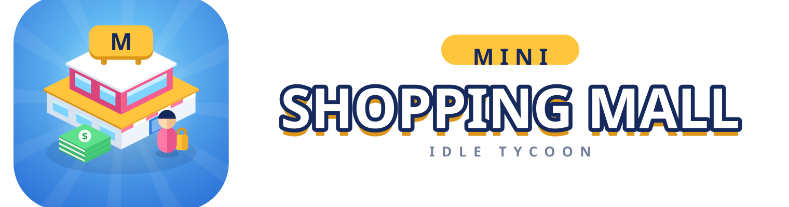
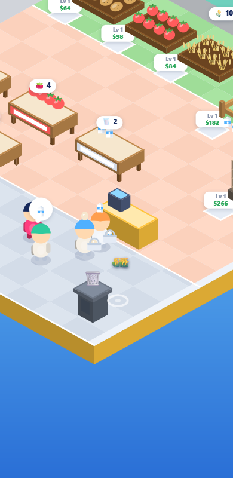

<p align="center">
  
</p>

# Mini Shopping Mall

An arcade-idle store tycoon in the mould of *My Mini Mart*: you drive the
character around one store at a time, read what each customer wants from the
bubble over their head, restock that shelf from the back room, and ring them
up. Cash lands on the floor — walk over it. Earn enough and the map unlocks
the next store.

<p align="center"></p>

## Run it

```bash
npm start
```

Then open http://127.0.0.1:8788. There is no build step — `index.html` also
works if you just double-click it.

## Controls

| | |
| --- | --- |
| **Drag anywhere** | floating joystick — the stick appears where you touch |
| | it is analog: a small push walks, a full push runs |
| **WASD / arrows** | same thing on desktop |
| **Scroll wheel** | zoom |

Walk up to the **bin** on the shop floor to empty your arms — useful when you
grabbed the wrong thing.

## Your first five minutes

You start with **$500** in a closed, empty store. A gold arrow walks you
through the spec-standard opening: stand on the **checkout plot** and $100
drains in to build the counter, harvest potatoes, stock their shelf, flip the
**OPEN sign** by the door, serve the first customer at the till, and run over
the cash. FIRST SALE — then the game opens up.

Customers only come in while the sign says OPEN, and once the tutorial is done
they carry **shopping lists** — up to three different items, collected shelf
by shelf and paid in one total at the till. Carrying a full armful slows you
down; the bin is where mistakes go.

## The loop

1. **Customers arrive on their own schedule**, stocked or not, and each shows
   the product they came for in a thought bubble.
2. **Read the floor** — a green ring round the bubble is their patience. It
   drains only while they stand at an empty shelf. At zero they walk out
   angry and the sale is lost.
3. **Restock** — everything is *made* on site, not delivered. Crop beds sit
   back-left, the animal pens back-right, the oven off to the side:

   | Product | Comes from | Needs |
   | --- | --- | --- |
   | Potato, Tomato, Carrot, Eggplant, Cabbage, Wheat | crop beds along the back | just time |
   | Apple, Banana, Orange | the orchard down the right | just time |
   | Milk | the cow, in the farmyard down the left | wheat in its trough |
   | Eggs | the chicken coop, below the cow | tomatoes |
   | Bread | the oven, by the door | wheat |

   The shop floor is laid out by department — **Vegetables**, **Fruit**, and
   **Dairy & Bakery** — each a tinted block of floor with its name on it.

   So the chain is: harvest → carry to whatever eats it → carry what that
   makes to the shelf. Your arms hold **10 items of any mix**, stacked over
   your head (12 max), so one trip can carry potatoes and tomatoes together.
4. **Level up in the world** — every station has a pad beside it. Stand on it
   and your cash drains into the next level, which raises that product's
   price and speeds up how fast it is made.
5. **Serve** — stand behind the till and the queue clears, one every 0.6s.
   Each sale drops cash on the floor.
6. **Collect** — run over the cash. Piles left more than 9 seconds bank
   themselves, so idling still pays.
7. **Expand** — open the Map and buy the next store.

Only the Grocery Store has the full farm chain so far — the Boutique and
Electronics still make their goods without an input, and still borrow this
floor plan. The Coffee Shop and the Sport Outlet are different games
entirely — see below.

**Staff** take over the parts you are tired of doing. A stocker hauls feed to
whatever is starving, then restocks the emptiest shelf; the cashier works the
till. You can hire **up to four stockers** — each costs 3.2x the last — and
they claim jobs so two never chase the same shelf. One alone cannot keep
eleven shelves and four feed stations going. A store only earns while you
are elsewhere — or offline, 2 hours max at half rate — with **both** hired.

**Upgrades** raise the price per item. Levels 10 / 25 / 50 / 100 / 200 are
milestones that multiply the price and speed up deliveries. Mall level rises
with your total product levels and pays gems; gems buy a ×2 Rush Hour.

## Stage 2 — the Coffee Shop

The mini mart is a *stocking* game: you fill a shelf and the customer takes
one off it. The café is a *service* game, and nothing is ready in advance:

```
they queue at the counter  ->  you take the order        (a ticket)
you fetch beans and milk from the back room into the bar's storage
you stand at the machine   ->  it brews their drink      (a few seconds)
the drink lands on the pickup counter
you carry it over          ->  they pay, and they tip
they sit down, drink it, and leave a dirty table behind
you wipe it, or nobody can sit there
```

**Six ingredients** — beans, milk, matcha, cocoa, ice, pastry dough — refill in
crates along the back wall. Carry them to the **ingredient storage** by the
bar; the machines draw on that, never on the crates. An empty bin is why
nothing is brewing.

**Ten recipes** live on the **menu board** in the back right, each its own
plaque you walk onto and pay for: Espresso, Americano, Latte, Cappuccino, Iced
Coffee, Mocha, Matcha Latte, Iced Matcha, Croissant, Cake. Each names what it
takes and which of the three machines makes it — the **Coffee Machine**, the
**Matcha & Ice Bar** or the **Pastry Oven**. Machines level up on their own
pads: faster, and more cups on the go at once.

The drink machines are the bar; the oven is the **kitchen**, and it is a
different job. Once the oven is built, customers start ordering **food with
their drink** — a latte and a cake on one ticket, shown side by side in their
bubble. The ticket splits into one job per item, each routed to its own
station, and the customer pays the whole bill (and tips on it) when the last
item reaches their hands.

**Patience** is the ring round a customer's bubble. It starts draining after a
few seconds in the queue, and from the moment you take their order. Run it out
and they walk. Serve them fast, in a clean room, and they **tip** — that is
where the café's real money is.

**Seating** is six tables, two free and the rest build plots. A served
customer takes a seat, drinks for ten seconds or so, and leaves the table
dirty; a dirty table cannot be sat at and drags your tips down. If every table
is dirty or taken they take the drink away instead.

The café has four jobs the mini mart never had, on top of runners and a
cashier: a **Barista** works the drink machines, a **Chef** works the oven, a
**Server** runs the orders out, and a **Cleaner** clears the tables. A machine
only runs when its own person is hired — or you stand at it yourself; the
barista never bakes and the chef never brews. It earns unattended once the
runner, cashier, barista and server are hired; the food lines pay only with
the chef too.

## Stage 3 — the Sport Outlet

The mini mart is a *stocking* game and the café a *service* game. The outlet
is a **selling** game: the goods are already made and already on the rack, and
the only question is whether anybody buys them.

```
they come in wanting one thing  ->  they find its rack
they take it down               ->  and carry it to the test area
they try it                     ->  a few seconds on the court
you stand with them a moment    ->  and talk them through it
they decide                     ->  😊 buy   😕 too dear   😞 not for me
a no goes back on the rack, and sometimes they ask to see another
```

**Nobody buys what they have not tried.** Four sports — running, football,
basketball, badminton — two lines each, and a **court** for every one of
them: a treadmill, a goal, a hoop, a net. Each court is a plot you walk onto
and pay for, and a sport without one still sells, to about **half** as many
people. That number is printed on every line in the Products sheet.

**Advice is the other half of the sale.** A shopper holding something and
wondering shows a **❓** over their head; stand with them for a moment and
they are talked into it. It is the stage's version of working the till — the
❓s are your to-do list. A hired **Sports Advisor** walks the floor doing it
without you, and the shop earns nothing unattended until you have one.

Some shoppers simply cannot afford what they picked up; good advice steers
them to something they can. The **Conversion** row in Staff is the honest
scoreboard: how many of the people who walked in walked out with a bag.

## Stage 4 — the Fashion Boutique

The outlet asks whether you can talk somebody into a sale. The boutique asks
a smaller, harder question: **have you got it in their size, and is there
anywhere to try it on?**

```
they come in wanting an outfit  ->  one piece, sometimes two
they find the rail              ->  and look for THEIR size
the size is there               ->  it comes off the hanger
the size is not                 ->  📏 "have you got this in L?"
                                     and you fetch one from the back
they take it to a cubicle       ->  if one is free, or they queue
they try it on                  ->  a few seconds behind the curtain
they decide                     ->  😊 buy   😞 leave it on the rail
```

**A full rail can still be an empty rail.** Every garment hangs in four
sizes, and each rail shows the breakdown on the floor — `S 2 · M 0 · L 1 ·
XL 3`, with a red pip for a size that has run out. Six of the eight lines are
garments; the cap and the handbag have no size and skip the cubicle
entirely, which makes them the easy sale when the shop is heaving.

**"Have you got this in L?"** is the stage's job. A shopper stood at a rail
with none of their size raises a 📏 over their head and waits — on a shorter
fuse than anything else in the game. Walk to the stockroom, pick one up,
carry it over, and it goes straight into their hands. Being served like that
is worth a sale on its own. A hired **Fashion Assistant** runs those errands
for you, and the shop earns nothing unattended until you have one.

**The cubicles are the bottleneck.** Two come with the shop and three more
are build plots. Everyone trying on a garment needs one, and when they are
all curtained shut the queue outside starts losing people:

| Fitting rooms | Conversion |
| --- | --- |
| 2 | 41% |
| 5 | 66% |

## Stage 5 — TechHub

The boutique asks whether you have the right size. TechHub asks the question
electronics actually turn on: **which one?** Nobody comes in for "the
TechPhone" — they come in for *a phone*, with a priority and a budget, and
the shop stocks a PAIR in every department that pulls opposite ways:

| Department | The pair | The argument |
| --- | --- | --- |
| 🎧 Audio | TechBuds vs TechSound Max | battery life vs room-filling sound |
| 📱 Phones | TechPhone vs TechPhone Pro | all-week battery vs the camera |
| 💻 Laptops | TechBook Air vs TechBook Pro | thin and long-lived vs fast and hungry |
| 📺 Screens | TechView 144 vs TechVision TV | refresh rate vs sheer size |

```
they come in wanting a KIND of thing  ->  💻 + ⚡ floats over their head
they find the first display           ->  look it over
they carry it to the demo bench       ->  hands-on, a few seconds
then the other one                    ->  same again
they weigh the two                    ->  ⚖️ against THEIR priority
the winner they can afford            ->  a sealed box off the stand
```

**Demoing is free; selling needs a box.** Fifty people can try the floor
unit, but the sale takes a sealed box on the stand — that is what the
stockers haul, and a shopper who has already said yes will stand and wait at
an empty stand exactly as long as their patience lasts.

**A spec sheet is noise until somebody translates it.** Cold — no bench, no
advice — barely a quarter of shoppers buy. Each department's **demo bench**
is a build plot; a hired **Tech Advisor** (or you, standing with a ❓
shopper) hears the priority, points at the right one, finds the budget for
it, and sends them to the bench with their answer:

| Shop floor | Conversion |
| --- | --- |
| Cold — no benches, nobody advising | 28% |
| All four benches | 62% |
| Benches + Tech Advisor | 70% |

Electronics money makes it worth the trouble: a grocery basket is worth tens,
a TechVision TV is worth millions.

## Stores

| Store | Unlock | Products |
| --- | --- | --- |
| Grocery Store | free | 11 lines across vegetables, fruit, dairy and bakery |
| Coffee Shop | $6K | 6 ingredients, 10 recipes, 3 machines — made to order |
| Sport Outlet | $180K | 4 sports, 8 lines, 4 courts — tried before they are bought |
| Fashion Boutique | $4.2M | 8 lines in 4 sizes, 5 fitting rooms — tried on before they are bought |
| TechHub | $95M | 4 departments, 8 lines in rival pairs, 4 demo benches — compared before they are bought |

Unlock a store once, then travel between them freely from the Map.

Progress autosaves to `localStorage` every 10 seconds and when you leave.

## Backing up

Settings → **Export** writes a dated `.json` you can keep anywhere; **Import**
reads one back. Both work from a double-clicked `index.html`.

A **Google Drive** copy uses the same layer as MoneyFlow and FinSim — one file
in a folder of your own, `drive.file` scope, manual push/pull plus an opt-in
auto-backup. It needs the game served from a real origin (GitHub Pages, or an
authorised `localhost`) and an OAuth client ID you create yourself. See
[`docs/DRIVE.md`](docs/DRIVE.md); until `src/drive-config.js` is filled in the
Drive row just says it is not set up.

Restoring always **replaces, never merges**, confirms first, and reloads.

## Layout

```
src/config.js      balance, the store list, and one floor plan per shop  <- tune here
src/iso.js         isometric projection + the camera that trails you
src/state.js       game state, economy maths, save/load, offline
src/world.js       what is solid, and how bodies move and slide
src/entities.js    player, stocker, customers and their wants, cash
src/cafe.js        stage 2: orders, brewing, serving, tips, tables, crew
src/cafe-render.js stage 2's fixtures — crates, menu board, machines, tables
src/sports.js      stage 3: browsing, the trial, advice, the buy decision
src/sports-render.js stage 3's fixtures — the stockroom and the four courts
src/boutique.js    stage 4: sizes, size requests, the cubicles, trying on
src/boutique-render.js stage 4's fixtures — hanging rails and fitting rooms
src/tech.js        stage 5: needs, demos, the comparison, advice
src/tech-render.js stage 5's fixtures — lit displays and the demo benches
src/render.js      canvas scene + the joystick
src/art.js         one painter per product — potatoes, tomatoes, cups...
src/ui.js          HUD, bottom sheets, toasts
src/game.js        loop, input, the till, unlocking and travelling
src/backup.js      export / import the save file
src/drive.js       the Google Drive copy (config in src/drive-config.js)
tools/dev-server.mjs  static server for `npm start`
tools/build-logo.mjs  generates every file in assets/logo
```

Scripts load as plain `<script>` tags into one `MSM` namespace — no bundler, no
modules, so the file:// path keeps working.

## Not built yet

Sound, prestige, per-store decoration, and a tutorial past the first sale.
Customers and staff do not collide with anything — only the player does — so
they clip through fixtures on the diagonal. The café has no day cycle, so
there is no end-of-day summary and no missions yet. All five stores now have
their own floor plan and their own game.

The Sport Outlet has the trial and the advice, but not yet per-product
**quality tiers** and brands, setting your own **prices**, seasonal
**promotions and events** that spike one sport's demand, store
**reputation** and the VIP athletes it attracts, or the further sports
(tennis, swimming, cycling, fitness) the zones are shaped to take. A trial is
a progress bar, not yet an animation of the swing.

The Boutique has sizes, the size request and the cubicles, but not **colours**
as a second axis, **outfit style matching** (casual / smart / winter), fashion
**trends** and seasons that move demand week to week, **promotions** and
bundles, VIP shoppers, or assistant levels. Every shop still has one till.

TechHub has the demo, the comparison and the advisor, but not the late-game
retail systems its design sketches: **delivery** for the big boxes, a
**service desk** with warranty, repairs and a technician, **trade-ins**,
setup/installation, storage-and-colour variants, product **launch events**
with queues round the block, or a supplier tier system.

## Brand

App icon, wordmark and lockup live in [`assets/logo/`](assets/logo/) — see
[`assets/logo/BRAND.md`](assets/logo/BRAND.md) for the palette and usage rules.

```bash
npm run logo:png     # regenerate every SVG + PNG export
```
